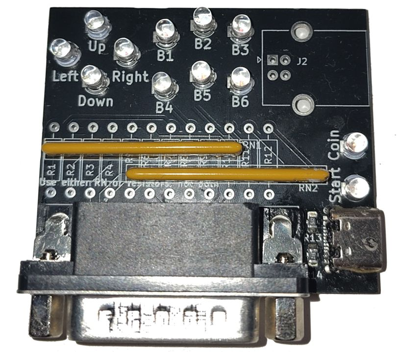

# neogeo_controller_tester

A simple board that tests the pins of a NeoGeo/Supergun-compatible DA15 controller. Ultimately this is a slightly fancy way of getting 5V through a bunch of LEDs, which will illuminate when the corresponding button is pressed.

I created this for my own use with building [my 9pin2supergun project](https://github.com/turmoni/9pin2supergun), as a simple visual way to check whether my hardware and code were working properly, but I can imagine it being useful to other people.

This is also a bit of a first step in figuring out how to share a KiCad project properly.

## Building one

The KiCad project is in this directory, and for convenience each push gets rendered to the `rendered` directory as a PDF of the schematics, and a set of gerber files. You *should* be able to use [the gerber archive](rendered/gbr.zip) to order boards directly, but for best results you should generate them yourself following your PCB fabricator's instructions (e.g. [for JLCPCB](https://jlcpcb.com/help/article/how-to-generate-gerber-and-drill-files-in-kicad-7)).

This board is designed to be pretty simple to put together, with the option to entirely use through-hole components if you are happy using USB type B for power, or a few surface mount ones if you want to use type C.

The BOM is largely up to your requirements; pretty much any normal LEDs will work, and the resistor value you choose is dependent on your LED and preferred brightness. I have put together [a list on DigiKey](https://www.digikey.co.uk/en/mylists/list/GHFYWIZHWM) for the parts I'm using, but there are still some options:

 * Omit the type C connector and 5.1k resistors if you only want to work with through-hole soldering
 * Omit the type B connector if you don't want it
 * The LED resistors can either be separate individual resistors of your chosen value, or SIP resistor arrays, whichever you prefer/can get your hands on. There should be no functional difference, I just found it tedious dealing with shaping, soldering, and snipping twelve individual resistors in the first revision of this board

## Using

There's not really much to it - plug it into a single power source (type B, type C, or, if it provides power (which it likely shouldn't), your controller), press buttons, see what lights up.
